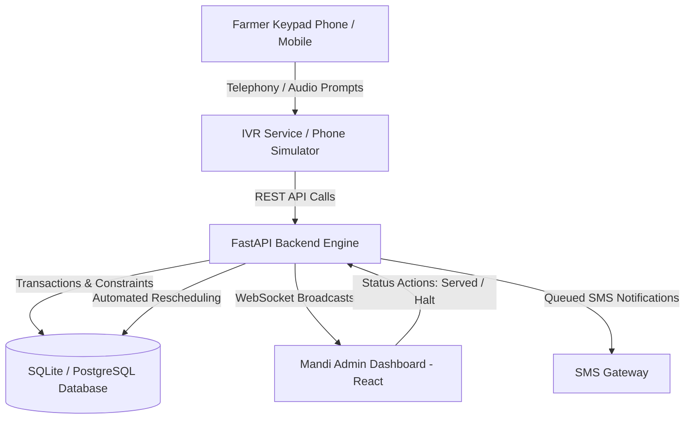

# 🌾 MandiQ - Voice-First Smart Mandi Queue & Procurement Management System
> **Smart India Hackathon (SIH 2026)** | **Team RootCause** | **Track:** Agriculture, FoodTech & Rural Development

---

## 👥 Team RootCause (SIH 2026)
- **Team Name:** Team RootCause
- **Hackathon:** Smart India Hackathon 2026
- **Project:** MandiQ — Voice-First Automated Mandi Queue & Procurement Integrity System
- **Mission:** Bridging the digital divide for illiterate farmers to eliminate corruption, bribery, and middleman exploitation at agricultural mandis.

---

## 🌐 Live Deployment & Demo Links
- 🎥 **Video Demonstration (YouTube):** [https://youtu.be/1_8FGb6jPUo](https://youtu.be/1_8FGb6jPUo)
- 🖥️ **Live Web Application (Vercel):** [https://frontend-omega-fawn-51.vercel.app/](https://frontend-omega-fawn-51.vercel.app/)
- 🚀 **Live API & WebSocket Backend (Render):** [https://mandiq-sih-2026.onrender.com/](https://mandiq-sih-2026.onrender.com/)
- 📖 **Interactive API Documentation (Swagger):** [https://mandiq-sih-2026.onrender.com/docs](https://mandiq-sih-2026.onrender.com/docs)

---

## 📌 Executive Summary
**MandiQ** is an automated, voice-first mandi slot booking and queue management system designed to eliminate middleman exploitation, bribery, and queue manipulation at agricultural procurement centers. 

According to government survey data (Census & NSS 77th Round), **over 25% of agrarian household heads in India are illiterate**, and **fewer than 20% utilize mobile applications for agriculture**. By replacing complex smartphone apps with an **Interactive Voice Response (IVR) phone system in native regional dialects**, MandiQ makes transparent slot scheduling accessible to over **80% of Indian farmers** using any basic feature phone.

---

## ⚡ Problem vs. Solution (Theory of Tables)

### 1. The Operational Challenges & Anti-Corruption Impact
A concise overview of the bottlenecks in traditional mandis and how MandiQ resolves them:

| Challenge / Vulnerability | Traditional Malpractice (Middlemen / Centers) | MandiQ Automated Solution |
| :--- | :--- | :--- |
| **Token Assignment** | Arbitrary & bribe-driven; early slots sold to affluent middlemen. | **Algorithmic Fair-Share**: System auto-assigns sequential, non-overlapping 15-min slots without human intervention. |
| **Information Gap** | Farmers wait days without knowing when weighing starts; prone to distress sales. | **On-Demand Voice Check**: Dialing IVR immediately announces token number, exact slot time, and live queue position. |
| **Middleman Arbitrage** | Intermediaries hoard slots under fake identities to buy cheap from desperate farmers. | **Unique Phone Enforcement**: Database constraint restricts strictly one active booking per verified phone number. |
| **Sudden Delays** | Unannounced halts force farmers to wait in lines; perishable crops decay. | **1-Click Halt & Reschedule**: Transparently moves farmers to the next day with automated SMS audit records. |

---

### 2. Database Schema (Theory of System Entities)
MandiQ's relational database is structured to enforce transparency and non-repudiation:

| Table Entity | Key Fields | System Purpose & Business Rule |
| :--- | :--- | :--- |
| `farmers` | `phone_number` (Unique, Indexed), `name`, `village`, `crop` | Farmer profile. Unique phone ensures identity verification without requiring smartphone logins. |
| `slots` | `date`, `start_time`, `end_time`, `capacity`, `booked_count` | 15-minute procurement windows. Enforced with a `UniqueConstraint('date', 'start_time', 'end_time')` to prevent double-booking. |
| `bookings` | `token_number` (Unique), `farmer_id`, `slot_id`, `status` | Links farmer to a slot. Status tracks lifecycle: `waiting` ➔ `served`, `halted`, or `no_show`. |
| `notifications` | `farmer_id`, `message`, `status`, `created_at` | Audit trail for all rescheduled or halted bookings sent to the farmer's mobile via SMS. |

---

### 3. Demographic Feasibility & Delivery Channels
Comparison showing why IVR voice telephony is the only viable channel for universal rural adoption:

| Access Channel | Farmer Reach | Critical Barriers in Rural India |
| :--- | :---: | :--- |
| **Mobile Apps (Smartphone)** | **15% - 20%** | High smartphone cost, internet data plans, UI/UX literacy barriers. |
| **SMS (Text)** | **35% - 40%** | Requires text literacy; prone to being misread or exploited by middlemen. |
| **IVR Voice Telephony (MandiQ)** | **75% - 80%** | **Zero literacy barrier**; works on basic feature keypad phones in native dialects. |
| **Physical Mandi Counter** | ~100% | High corruption risk; physical queuing enables extortion and bribery. |

---

## 🚀 Key Features

### 1. 📞 Voice-First IVR Phone Simulator (Dial 1 / 2)
- **Zero App Required**: Works on basic keypad phones (e.g. Nokia 3310) and smartphones alike.
- **Multilingual Voice Prompts**: Available in Hindi (`hi-IN`) and English (`en-US`) with speech synthesis.
- **Press 1**: Book a procurement slot for Wheat, Sugarcane, or Paddy.
- **Press 2**: Check live booking status, token number, and scheduled arrival time.
- **Instant Confirmation**: Displays a simulated SMS receipt with token number and entry window.

### 2. 🖥️ Real-Time Admin Dashboard
- **Live WebSocket Feed**: Real-time queue updates broadcast instantaneously to mandi officials without page reloads.
- **Interactive Sorting & Filtering**:
  - Sort by **Token Number**, **Farmer Name**, **Crop**, **Date & Time**, or **Status**.
  - Instant text search across tokens, names, villages, and crop types.
  - Quick filter dropdown for `Waiting`, `Served`, `Halted`, or `No-Show`.
- **Status Lifecycle Control**:
  - `✅ Served`: Mark farmer transaction as completed.
  - `❌ No-Show`: Flag unattended slot allocations.
  - `⏸ Halt`: Reschedules farmer to the next business day at the same time window, logging an SMS alert.

### 3. 🛡️ Robust Backend & Anti-Corruption Guard
- **Concurrency & Transaction Safety**: SQLite/PostgreSQL with async SQLAlchemy and row-level locking.
- **Unique Slot Enforcer**: Strictly prevents overlapping 15-minute intervals.
- **Eager-Loaded ORM Relationships**: High-performance async joined loading preventing database IO bottlenecks.

---

## 🏗️ System Architecture



---

## 🛠️ Technology Stack

- **Backend**: Python 3.11, FastAPI, Uvicorn, SQLAlchemy 2.0 (AsyncIO + Aiosqlite)
- **Frontend**: React 18, Vite, Modern Responsive Glassmorphic CSS
- **Real-Time Communication**: Native WebSockets (`/ws/queue`)
- **Speech Synthesis**: Web Speech API (`SpeechSynthesisUtterance`)
- **Documentation & Reporting**: ReportLab PDF Engine, Swagger / OpenAPI

---

## 📂 Project Structure

```
MandiQ/
├── app/
│   ├── main.py                  # FastAPI entrypoint, lifespan, CORS, and routing
│   ├── database.py              # Async database connection and session maker
│   ├── models.py                # Database models (Farmer, Slot, Booking, Notification)
│   ├── schemas.py               # Pydantic validation schemas
│   ├── parv_routes.py           # Core queue, IVR, booking, halt, and status endpoints
│   └── websocket_manager.py     # Real-time WebSocket connection manager
├── frontend/
│   ├── src/
│   │   ├── components/
│   │   │   ├── PhoneSimulator.jsx # Interactive Nokia keypad IVR simulator with speech
│   │   │   └── QueueTable.jsx     # Live real-time dashboard with search & sorting
│   │   ├── services/
│   │   │   ├── api.js             # Axios client for backend communication
│   │   │   └── websocket.jsx      # React WebSocket context & listener hook
│   │   ├── App.jsx                # Main layout with tab navigation
│   │   └── index.css              # Custom styling, dark mode & badge colors
│   ├── package.json
│   └── vite.config.js             # Vite dev server config with proxy
├── MandiQ_Farmer_Demographics_Report.pdf # Field data & feasibility study
├── mock_customers_100.json      # 100 realistic customer records for testing
├── requirements.txt             # Python dependencies
└── README.md
```

---

## 🚦 Getting Started & Local Setup

### Prerequisites
- Python 3.10+ installed
- Node.js 18+ and npm installed

### 1. Clone the Repository
```bash
git clone https://github.com/abhishekgoswami0720/Team-RootCause----MandiQ----SIH-2026.git
cd Team-RootCause----MandiQ----SIH-2026
```

### 2. Backend Setup
```bash
# Install Python dependencies
pip install -r requirements.txt

# Run FastAPI backend with Uvicorn
uvicorn app.main:app --reload --host 0.0.0.0 --port 8000
```
- API Documentation available at: `http://localhost:8000/docs`

### 3. Frontend Setup
```bash
# Navigate to frontend folder
cd frontend

# Install node packages
npm install

# Start Vite development server
npm run dev
```
- Dashboard UI available at: `http://localhost:5173`

---

## 🧪 Testing the Solution

You can test MandiQ either **instantly via the live cloud deployment** or **locally on your machine**:

### 🌐 Option A: Testing on Live Deployment (No Installation Required)
1. **Open the Live App**: Visit [https://frontend-omega-fawn-51.vercel.app/](https://frontend-omega-fawn-51.vercel.app/).
2. **Explore the Real-Time Queue**:
   - Notice the **100 pre-populated farmer records** across working time slots.
   - Test the **interactive column sorting**: click on headers (**Token**, **Farmer**, **Crop**, **Date & Time**, or **Status**) to sort ascending/descending.
   - Use the **instant search bar** to filter by farmer name, village, or crop (e.g., search *"Wheat"* or *"Rampur"*).
   - Use the **Status dropdown** to view only `Waiting`, `Served`, `Halted`, or `No-Show` bookings.
3. **Simulate a Voice Call (IVR)**:
   - Switch to the **IVR Simulator** tab in the top navigation bar.
   - Choose your preferred language: **Hindi (हिंदी)** or **English**.
   - Click the green **CALL** button.
   - Listen to the spoken voice prompt.
   - Press **`1`** on the Nokia keypad to initiate slot booking, then press **`1` (Wheat)**, **`2` (Sugarcane)**, or **`3` (Paddy)**.
   - Observe the spoken audio confirmation and the **simulated SMS notification receipt** containing the generated Token Number and assigned entry time.
4. **Verify On-Demand Status Retrieval**:
   - Place another call and press **`2`** to check status.
   - The IVR will retrieve your active booking and announce your token, time window, and status in spoken audio.
5. **Test the Anti-Corruption Halt & Reschedule Feature**:
   - Switch back to the **Dashboard** tab.
   - On any farmer with `WAITING` status, click the red **⏸ Halt** button.
   - Notice how the status immediately turns to **`HALTED`**, the date is automatically advanced to the next business day (`2026-09-14`), and an SMS audit notification is generated.

---

### 💻 Option B: Testing Locally
1. Start the FastAPI backend: `uvicorn app.main:app --reload --host 0.0.0.0 --port 8000`.
2. Start the Vite frontend: `cd frontend && npm run dev`.
3. Open [http://localhost:5173](http://localhost:5173) in your browser.
4. Open the Swagger API docs at [http://localhost:8000/docs](http://localhost:8000/docs) to test endpoints directly (`/book`, `/queue`, `/queue/halt`, `/simulate/status/{phone}`).
5. Watch live queue updates broadcast in real-time over native WebSockets (`/ws/queue`) as actions are triggered.

---

## 👥 Submission Note
Submitted for **Smart India Hackathon 2026** by **Team RootCause**.
